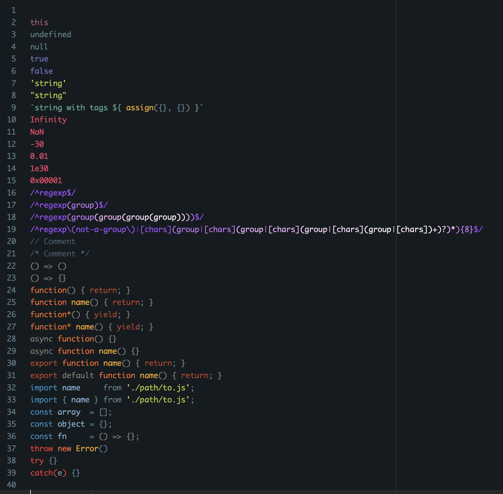

**Cruncher** provides a warm and dark editor theme, and 'JS' and 'Literal'
syntaxes. The 'JS' syntax extends the internal JavaScript syntax with
highlighting for nested regexp groups, and colour differentiation between
numerical, stringy, functional, declarative and control flow keywords and
parentheses.

